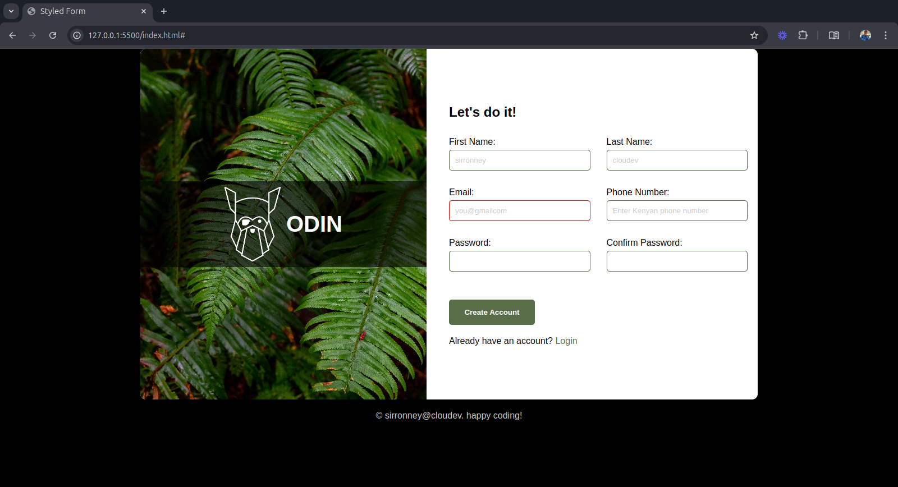

# Odin Forms



## Technologies Used

- HTML
- CSS

## Setup

1. Clone the repository:

    ```sh
    git clone <repository-url>
    ```

2. Navigate to the project directory:

    ```sh
    cd odin-forms
    ```

3. Open `index.html` in your web browser to view the form.
